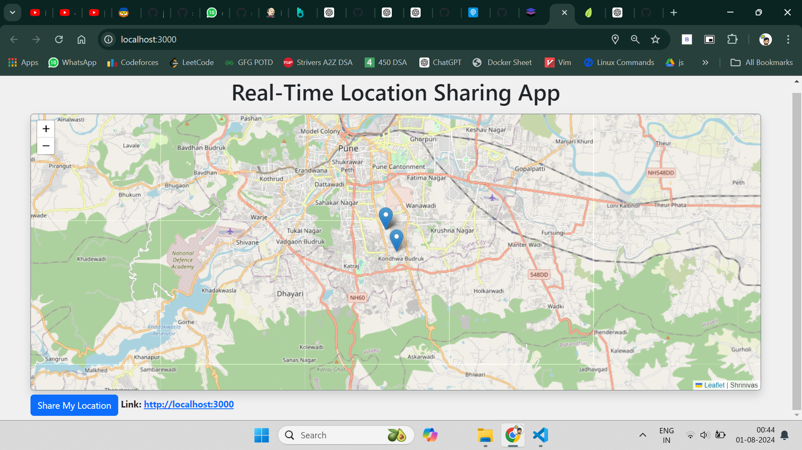

# Realtime Device Tracker

A real-time device tracking application built with Node.js, Express, Socket.IO, and Leaflet. This application allows users to track their devices' locations on a map in real-time using geolocation.



# Implemented CI/CD pipeline
- Implemented a CI/CD Pipeline integrating **GitHub** with **Jenkins** for automated build and deployment.
- Utilized **SonarQube scanner** for code quality analysis and **OWASP Dependency-Check** for security
vulnerability scanning.
-  Automated **Docker** image creation, pushed images to **DockerHub**, and scanned them using **Aqua Trivy**.
- Deployed and **Containerized** the application using Docker, emphasizing secure DevSecOps practices.

## Screenshots


## Technologies Used

- **Node.js** ,**Express** ,**HTML/CSS** ,**Socket.IO**
- **Leaflet**: Open-source JavaScript library for interactive maps.
- **GitHub** - Source code repository.
- **Jenkins** - Continuous Integration & Continuous Deployment (CI/CD) automation server.
- **SonarQube** - Code quality analysis tool.
- **OWASP Dependency-Check** - Tool for checking security vulnerabilities in dependencies.
- **Docker** - Containerization of the application.
- **Aqua Trivy** - Security scanner for Docker images.
- **DockerHub** - Container registry to store Docker images.

## CI/CD Pipeline Workflow

1. **Source Code Management**: Code is hosted on **GitHub**.
2. **Jenkins Integration**: Every code commit triggers a Jenkins build.
3. **Build and Unit Tests**: Jenkins builds the Node.js application and runs tests.
4. **SonarQube Analysis**: Code is scanned by **SonarQube** for code quality and potential bugs.
5. **OWASP Dependency-Check**: Automated scanning of libraries for security vulnerabilities.
6. **Docker Build**: Docker image is created, tagged, and pushed to **DockerHub**.
7. **Aqua Trivy Scan**: Docker image is scanned for vulnerabilities using **Trivy**.
8. **Deployment**: The containerized application is deployed automatically after successful scans and tests.

## Installation

1. **Clone the repository:**

    ```bash
    git clone https://github.com/username/repository.git
    ```
2. **Navigate to the project directory:**
3. Make sure you have `nodemon` installed globally:
   ```bash
   npm install 
   npm start
   ```
4. **Access the application:**
    Open your browser and go to `http://localhost:3000`.
